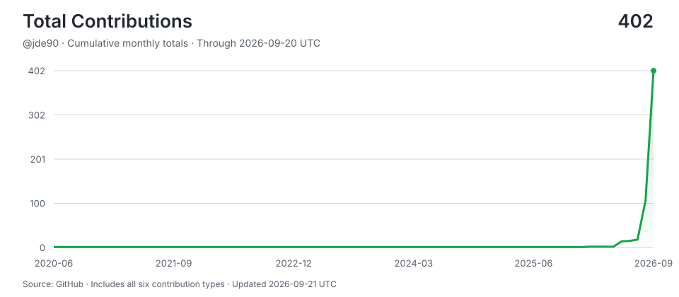

# jde90

> Shipping with AI agents around the clock -- human hours for thinking, machine hours for doing.
>
> Stats auto-updated by [aidevops](https://aidevops.sh).

<!-- STATS-START -->
## Work with AI

| Metric | Yesterday | Prior 7 Days | Prior 28 Days | Prior 365 Days |
| --- | ---: | ---: | ---: | ---: |
| Screen time (Mac) | 5.6h | 39.4h | 130.5h | ~1823h* |
| Interactive human attention | 3.5h | 34.1h | 114.2h | 289.2h |
| Interactive AI generation | 10.3h | 72.5h | 152.0h | 464.7h |
| Worker-classified human attention | 0.8h | 0.8h | 0.8h | 0.8h |
| Worker/headless AI generation | 2.7h | 3.7h | 9.4h | 57.8h |
| Additive observed work | 17.0h | 110.9h | 276.3h | 812.2h |
| Interactive sessions | 21 | 195 | 256 | 377 |
| Worker sessions | 82 | 126 | 623 | 1,830 |

_Screen time from macos-knowledge-db:/app/usage-union; collection status: ok. *365-day estimate uses observed calendar coverage._

_Periods are completed local calendar days ending at midnight; today is excluded._

_Human attention is unioned wall-clock time, so overlapping sessions are not double-counted. AI generation is additive machine work across sessions; it is not wall-clock concurrency._

_AI session 365-day totals cover 77 days of local assistant session history (not extrapolated)._

## AI Model Usage (last 30 days)

| Model | Requests | Input | Output | Cache read | Cache Hit-Rate % | Session Count | Session Hours |
| --- | ---: | ---: | ---: | ---: | ---: | ---: | ---: |
| claude-sonnet-5 | 17,143 | 35K | 8.5M | 6,655.8M | 100.0% | 226 | 81.5h |
| claude-opus-5 | 7,271 | 14K | 4.2M | 2,159.1M | 100.0% | 59 | 36.0h |
| big-pickle | 3,252 | 17.4M | 1.5M | 334.0M | 95.0% | 42 | 22.3h |
| gpt-5.6-sol | 2,780 | 15.3M | 848K | 389.9M | 96.2% | 18 | 15.8h |
| gpt-5.6-luna | 833 | 15.1M | 133K | 61.7M | 80.3% | 360 | 5.4h |
| gpt-5.6-terra | 747 | 5.2M | 172K | 64.2M | 92.4% | 63 | 3.5h |
| muse-spark-1.2-contributor-free | 228 | 1.7M | 47K | 59.0M | 97.1% | 1 | 0.5h |
| deepseek-v4-flash-free | 155 | 1.4M | 160K | 19.6M | 93.3% | 4 | 0.9h |
| claude-fable-5 | 120 | 240 | 62K | 23.4M | 100.0% | 1 | 0.6h |
| nemotron-3-ultra-free | 65 | 1.9M | 6K | 4.5M | 70.2% | 2 | 0.7h |
| nemotron-3.5-lightning-free | 29 | 930K | 12K | 1.7M | 65.5% | 6 | 0.3h |
| claude-haiku-4-5 | 5 | 17 | 1K | 103K | 100.0% | 4 | 0.0h |
| mimo-v2.5-free | 5 | 454K | 3K | 16K | 3.5% | 5 | 0.0h |
| **Total** | **32,633** | **59.7M** | **15.8M** | **9,773.5M** | **99.4%** | **731** | **167.6h** |

_10,169.6M total tokens processed. 99.4% cache hit rate._

## AI Model Usage (all time)

| Model | Requests | Input | Output | Cache read | Cache Hit-Rate % | Session Count | Session Hours |
| --- | ---: | ---: | ---: | ---: | ---: | ---: | ---: |
| claude-sonnet-5 | 21,577 | 44K | 11.5M | 7,821.6M | 100.0% | 261 | 104.1h |
| claude-opus-5 | 15,235 | 30K | 9.2M | 4,900.8M | 100.0% | 79 | 80.2h |
| gpt-5.6-sol | 14,305 | 63.4M | 3.0M | 1,111.0M | 94.6% | 789 | 73.4h |
| big-pickle | 7,688 | 32.5M | 2.5M | 715.3M | 95.7% | 115 | 43.4h |
| claude-opus-4-8 | 5,837 | 11K | 6.9M | 1,606.9M | 100.0% | 46 | 42.5h |
| deepseek-v4-flash-free | 3,290 | 10.5M | 1.1M | 331.3M | 96.9% | 37 | 14.8h |
| gpt-5.5 | 2,285 | 8.8M | 389K | 140.5M | 94.1% | 301 | 9.8h |
| gpt-5.6-terra | 1,287 | 9.2M | 282K | 93.0M | 91.0% | 168 | 5.4h |
| gpt-5.6-luna | 864 | 15.3M | 135K | 62.5M | 80.2% | 367 | 5.5h |
| claude-sonnet-4-6 | 360 | 468 | 254K | 62.6M | 100.0% | 3 | 1.8h |
| claude-opus-4-6 | 255 | 305 | 160K | 51.4M | 100.0% | 2 | 1.6h |
| muse-spark-1.2-contributor-free | 228 | 1.7M | 47K | 59.0M | 97.1% | 1 | 0.5h |
| claude-fable-5 | 141 | 282 | 116K | 24.8M | 100.0% | 4 | 0.8h |
| nemotron-3-ultra-free | 65 | 1.9M | 6K | 4.5M | 70.2% | 2 | 0.7h |
| gpt-5.4-mini | 53 | 1.3M | 4K | 4.0M | 75.1% | 1 | 1.2h |
| nemotron-3.5-lightning-free | 29 | 930K | 12K | 1.7M | 65.5% | 6 | 0.3h |
| claude-haiku-4-5 | 5 | 17 | 1K | 103K | 100.0% | 4 | 0.0h |
| mimo-v2.5-free | 5 | 454K | 3K | 16K | 3.5% | 5 | 0.0h |
| gpt-5.6 | 2 | 0 | 0 | 0 | 0.0% | 2 | 0.0h |
| gpt-5.6-fast | 2 | 0 | 0 | 0 | 0.0% | 2 | 0.0h |
| claude-opus-4-8-fast | 1 | 0 | 0 | 0 | 0.0% | 1 | 0.0h |
| **Total** | **73,514** | **146.4M** | **35.9M** | **16,991.8M** | **99.1%** | **2,036** | **386.1h** |

_17,763.3M total tokens processed. 99.1% cache hit rate._

## Top Apps by Screen Time

| App | Yesterday | Prior 7 Days | Prior 28 Days |
| --- | ---: | ---: | ---: |
| Tabby | 83% | 80% | 80% |
| Safari | 10% | 18% | 19% |
| Finder | 3% | 1% | 1% |
| QuickTimePlayerX | 2% | 1% | -- |
| Preview | 2% | 1% | -- |
| TextEdit | -- | -- | -- |
| System Settings | -- | -- | -- |
| macsys | -- | -- | -- |
| Music | -- | -- | -- |
| app | -- | -- | -- |
_Top 10 apps by foreground time share across completed local calendar days. Mac only._
<!-- STATS-END -->

## Projects

- **[huszka-weightlifting](https://github.com/jde90/huszka-weightlifting)** -- No description
- **[expired-gmb-domains](https://github.com/jde90/expired-gmb-domains)** -- Expired GMB Domains finds registerable and auction domains, verifies their availability, and surfaces exact Google Business Profile signals, so you can focus on names with evidence behind them.
- **[concrete-contractors-kenosha](https://github.com/jde90/concrete-contractors-kenosha)** -- Concrete Contractors Kenosha - static site for Cloudflare Pages
- **[concrete-contractors-dayton](https://github.com/jde90/concrete-contractors-dayton)** -- Concrete Contractors Dayton Ohio - static site
<!-- CONTRIBUTIONS-START -->
## Contributions

- **[aidevops](https://github.com/marcusquinn/aidevops)** -- Vibe-Coding is easy. DevOps is hard. OpenCode & Git token-efficient AI agent automation for your app, business, and personal development. Opinionated tools, services, CLI & API stack for speed, security, and 24/7 results. Open-source first. SOTA everything. Try on your repos for money-making magic.
<!-- CONTRIBUTIONS-END -->

## Connect

---

<!-- UPDATED-START -->
_Stats auto-updated 2026-09-10 18:19 UTC by [aidevops](https://aidevops.sh) pulse._
<!-- UPDATED-END -->

<!-- TOTAL-CONTRIBUTIONS-START -->

  <a href="https://commit-history.com/jde90?metric=total" target="_blank" rel="noopener noreferrer">
    <picture>
      <source media="(prefers-color-scheme: dark)" srcset="assets/contributions/total-dark.svg" />
      
    </picture>
  </a>

[Verify on commit-history.com](https://commit-history.com/jde90?metric=total) · [Chart data](assets/contributions/total.json)

Includes commits, issues, pull requests, reviews, repositories, and restricted contributions. Refreshed daily through the prior UTC day; commit-history.com may use a different refresh cutoff. GitHub controls link navigation—Ctrl/Cmd-click opens verification in a new tab.
<!-- TOTAL-CONTRIBUTIONS-END -->
