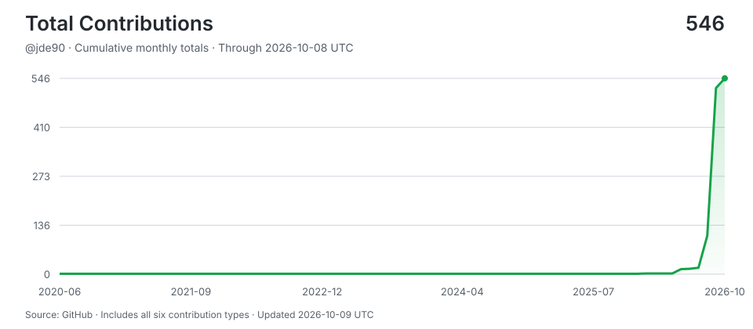

# jde90

> Shipping with AI agents around the clock -- human hours for thinking, machine hours for doing.
>
> Stats auto-updated by [aidevops](https://aidevops.sh).

<!-- STATS-START -->
## Work with AI

| Metric | Yesterday | Prior 7 Days | Prior 28 Days | Prior 365 Days |
| --- | ---: | ---: | ---: | ---: |
| Screen time (Mac) | 3.9h | 46h | 156.9h | ~1889h* |
| Interactive human attention | 3.1h | 30.8h | 93.7h | 382.9h |
| Interactive AI generation | 3.1h | 48.9h | 120.3h | 585.0h |
| Worker-classified human attention | 0.0h | 0.0h | 0.0h | 0.8h |
| Worker/headless AI generation | 2.5h | 18.7h | 55.7h | 113.5h |
| Additive observed work | 8.6h | 98.4h | 269.8h | 1,082.0h |
| Interactive sessions | 22 | 65 | 104 | 472 |
| Worker sessions | 71 | 245 | 1,001 | 2,793 |

_Screen time from screen-time-history:daily-observations; collection status: ok. *365-day estimate uses observed calendar coverage._

_Periods are completed local calendar days ending at midnight; today is excluded._

_Human attention is unioned wall-clock time, so overlapping sessions are not double-counted. AI generation is additive machine work across sessions; it is not wall-clock concurrency._

_AI session 365-day totals cover 105 days of local assistant session history (not extrapolated)._

## AI Model Usage (last 30 days)

| Model | Requests | Input | Output | Cache read | Cache write | Cache Hit-Rate % | Session Count | Session Hours |
| --- | ---: | ---: | ---: | ---: | ---: | ---: | ---: | ---: |
| claude-opus-5 | 18,239 | 36K | 4.9M | 3,090.9M | 136.9M | 95.8% | 810 | 67.5h |
| claude-sonnet-5 | 12,072 | 24K | 4.6M | 3,959.7M | 181.6M | 95.6% | 42 | 55.7h |
| claude-opus-5-5 | 3,402 | 7K | 1.7M | 686.5M | 28.5M | 96.0% | 27 | 17.0h |
| big-pickle | 2,894 | 20.5M | 1.6M | 320.2M | 0 | 94.0% | 33 | 10.5h |
| gpt-6.1-sol | 1,708 | 4.1M | 376K | 264.0M | 0 | 98.4% | 8 | 11.6h |
| gpt-5.6-terra | 1,595 | 17.2M | 506K | 141.1M | 0 | 89.1% | 103 | 8.7h |
| gpt-5.6-luna | 1,319 | 20.7M | 592K | 92.7M | 0 | 81.7% | 228 | 6.8h |
| gpt-5.6-sol | 1,070 | 7.7M | 394K | 165.8M | 0 | 95.5% | 12 | 7.2h |
| claude-sonnet-5-5 | 838 | 1K | 362K | 177.1M | 10.7M | 94.3% | 7 | 7.7h |
| gpt-6-luna | 341 | 2.2M | 68K | 48.5M | 0 | 95.5% | 5 | 1.6h |
| gpt-6-astra | 210 | 1.5M | 68K | 23.9M | 0 | 94.0% | 5 | 1.3h |
| longcat-2.5-preview-free | 102 | 149K | 9K | 12.3M | 0 | 98.8% | 1 | 0.3h |
| deepseek-v4-flash | 71 | 178K | 26K | 13.5M | 0 | 98.7% | 1 | 0.1h |
| claude-fable-5 | 46 | 92 | 43K | 7.7M | 652K | 92.3% | 2 | 0.4h |
| muse-spark-1.3-contributor-free | 27 | 114K | 4K | 2.2M | 0 | 95.1% | 2 | 0.0h |
| nemotron-3-ultra-free | 25 | 802K | 1K | 2.3M | 0 | 74.6% | 2 | 0.1h |
| deepseek-v4-pro | 21 | 412K | 10K | 6.1M | 0 | 93.7% | 2 | 0.2h |
| qwen2.5:14b-instruct-q4_K_M | 3 | 6K | 408 | 0 | 0 | 0.0% | 1 | 0.0h |
| mimo-v2.5-free | 2 | 172K | 2K | 16K | 0 | 8.7% | 2 | 0.0h |
| claude-fable-5-1 | 1 | 0 | 0 | 0 | 0 | 0.0% | 1 | 0.1h |
| pool-account-management | 1 | 0 | 0 | 0 | 0 | 0.0% | 1 | 0.0h |
| **Total** | **43,987** | **76.1M** | **15.4M** | **9,015.3M** | **358.5M** | **95.4%** | **1,143** | **196.9h** |

_9,465.5M total tokens processed. 95.4% cache hit rate._

## AI Model Usage (all time)

| Model | Requests | Input | Output | Cache read | Cache write | Cache Hit-Rate % | Session Count | Session Hours |
| --- | ---: | ---: | ---: | ---: | ---: | ---: | ---: | ---: |
| claude-sonnet-5 | 32,839 | 67K | 15.8M | 11,513.9M | 467.5M | 96.1% | 292 | 152.1h |
| claude-opus-5 | 32,722 | 65K | 13.9M | 7,852.8M | 319.5M | 96.1% | 859 | 145.1h |
| gpt-5.6-sol | 15,334 | 70.0M | 3.4M | 1,270.5M | 0 | 94.8% | 800 | 80.3h |
| big-pickle | 10,167 | 50.4M | 3.9M | 988.9M | 0 | 95.1% | 144 | 52.1h |
| claude-opus-4-8 | 5,837 | 11K | 6.9M | 1,606.9M | 98.3M | 94.2% | 46 | 42.5h |
| claude-opus-5-5 | 3,402 | 7K | 1.7M | 686.5M | 28.5M | 96.0% | 27 | 17.0h |
| deepseek-v4-flash-free | 3,290 | 10.5M | 1.1M | 331.3M | 0 | 96.9% | 37 | 14.8h |
| gpt-5.6-terra | 2,360 | 23.0M | 670K | 182.8M | 0 | 88.8% | 240 | 11.5h |
| gpt-5.5 | 2,285 | 8.8M | 389K | 140.5M | 0 | 94.1% | 301 | 9.8h |
| gpt-5.6-luna | 2,160 | 34.6M | 727K | 155.2M | 0 | 81.8% | 572 | 12.3h |
| gpt-6.1-sol | 1,708 | 4.1M | 376K | 264.0M | 0 | 98.4% | 8 | 11.6h |
| claude-sonnet-5-5 | 838 | 1K | 362K | 177.1M | 10.7M | 94.3% | 7 | 7.7h |
| claude-sonnet-4-6 | 360 | 468 | 254K | 62.6M | 3.4M | 94.8% | 3 | 1.8h |
| gpt-6-luna | 341 | 2.2M | 68K | 48.5M | 0 | 95.5% | 5 | 1.6h |
| claude-opus-4-6 | 255 | 305 | 160K | 51.4M | 2.5M | 95.3% | 2 | 1.6h |
| muse-spark-1.2-contributor-free | 228 | 1.7M | 47K | 59.0M | 0 | 97.1% | 1 | 0.5h |
| gpt-6-astra | 210 | 1.5M | 68K | 23.9M | 0 | 94.0% | 5 | 1.3h |
| claude-fable-5 | 187 | 374 | 159K | 32.6M | 2.8M | 91.9% | 6 | 1.2h |
| longcat-2.5-preview-free | 102 | 149K | 9K | 12.3M | 0 | 98.8% | 1 | 0.3h |
| nemotron-3-ultra-free | 90 | 2.7M | 8K | 6.8M | 0 | 71.6% | 4 | 0.8h |
| deepseek-v4-flash | 71 | 178K | 26K | 13.5M | 0 | 98.7% | 1 | 0.1h |
| gpt-5.4-mini | 53 | 1.3M | 4K | 4.0M | 0 | 75.1% | 1 | 1.2h |
| nemotron-3.5-lightning-free | 29 | 930K | 12K | 1.7M | 0 | 65.5% | 6 | 0.3h |
| muse-spark-1.3-contributor-free | 27 | 114K | 4K | 2.2M | 0 | 95.1% | 2 | 0.0h |
| deepseek-v4-pro | 21 | 412K | 10K | 6.1M | 0 | 93.7% | 2 | 0.2h |
| claude-haiku-4-5 | 5 | 17 | 1K | 103K | 415K | 20.0% | 4 | 0.0h |
| mimo-v2.5-free | 5 | 454K | 3K | 16K | 0 | 3.5% | 5 | 0.0h |
| qwen2.5:14b-instruct-q4_K_M | 3 | 6K | 408 | 0 | 0 | 0.0% | 1 | 0.0h |
| gpt-5.6 | 2 | 0 | 0 | 0 | 0 | 0.0% | 2 | 0.0h |
| gpt-5.6-fast | 2 | 0 | 0 | 0 | 0 | 0.0% | 2 | 0.0h |
| claude-fable-5-1 | 1 | 0 | 0 | 0 | 0 | 0.0% | 1 | 0.1h |
| claude-opus-4-8-fast | 1 | 0 | 0 | 0 | 0 | 0.0% | 1 | 0.0h |
| pool-account-management | 1 | 0 | 0 | 0 | 0 | 0.0% | 1 | 0.0h |
| **Total** | **114,936** | **213.8M** | **50.5M** | **25,496.4M** | **934.0M** | **95.7%** | **3,080** | **567.9h** |

_26,694.9M total tokens processed. 95.7% cache hit rate._
<!-- STATS-END -->

## Projects

- **[huszka-weightlifting](https://github.com/jde90/huszka-weightlifting)** -- No description
- **[expired-gmb-domains](https://github.com/jde90/expired-gmb-domains)** -- Expired GMB Domains finds registerable and auction domains, verifies their availability, and surfaces exact Google Business Profile signals, so you can focus on names with evidence behind them.
- **[concrete-contractors-kenosha](https://github.com/jde90/concrete-contractors-kenosha)** -- Concrete Contractors Kenosha - static site for Cloudflare Pages
- **[concrete-contractors-dayton](https://github.com/jde90/concrete-contractors-dayton)** -- Concrete Contractors Dayton Ohio - static site
<!-- CONTRIBUTIONS-START -->
## Contributions

- **[aidevops](https://github.com/marcusquinn/aidevops)** -- Vibe-Coding is easy. DevOps is hard. OpenCode & Git token-efficient AI agent automation for your app, business, and personal development. Opinionated tools, services, CLI & API stack for speed, security, and 24/7 results. Open-source first. SOTA everything. Try on your repos for money-making magic.
<!-- CONTRIBUTIONS-END -->

## Connect

---

<!-- UPDATED-START -->
_Stats auto-updated 2026-10-09 04:02 UTC by [aidevops](https://aidevops.sh) pulse._
<!-- UPDATED-END -->

<!-- TOTAL-CONTRIBUTIONS-START -->

  <a href="https://commit-history.com/jde90?metric=total" target="_blank" rel="noopener noreferrer">
    <picture>
      <source media="(prefers-color-scheme: dark)" srcset="assets/contributions/total-dark.svg" />
      
    </picture>
  </a>

[Verify on commit-history.com](https://commit-history.com/jde90?metric=total) · [Chart data](assets/contributions/total.json)

Includes commits, issues, pull requests, reviews, repositories, and restricted contributions. Refreshed daily through the prior UTC day; commit-history.com may use a different refresh cutoff. GitHub controls link navigation—Ctrl/Cmd-click opens verification in a new tab.
<!-- TOTAL-CONTRIBUTIONS-END -->
